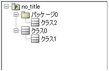
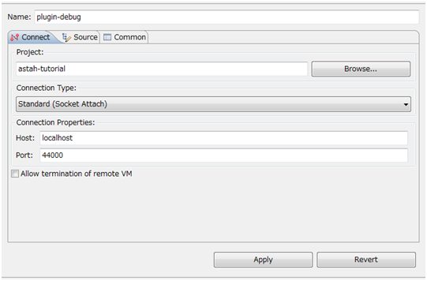

クラスの総数を表示するプラグインを作ってみましょう
=======================================================

ここまでに作成した単純なプラグインをベースに、実践的なプラグインを作成してみましょう。
設計されたモデルの品質を評価する際、指標としてクラスの総数を利用することがあります。
Hello Worldの代わりに、astah*モデル内のクラスの総数を表示するプラグインを作成してみましょう。

次のastah*モデルでは、クラスの総数は3つです。

プラグインによって追加したメニューを押下すると､ ::

 「There are 3 classes」

と表示されるようにしてみましょう。

モデル情報を取得してみましょう
-------------------------------------------------------

astah*のモデル情報を取得するために、astah* APIを活用してみましょう。astah* APIとは、astah*のモデルデータを活用するアプリケーションを開発するためのJavaインターフェース群です。詳細については、本体に付属するastah* API利用ガイドを参照してください。

これから書くコードでは、ProjectAccessorから現在開いているastah*モデルのルートモデルを取得し、再帰的にすべてのクラスを取得します。それではクラスの総数をメッセージダイアログに表示するようにHelloWorldプラグインを修正してみましょう。

まず、CountClassActionクラスを作成しましょう。

.. literalinclude:: _snippets/CountClassAction.java
   :language: java
   :linenos:

次に､plugin.xmlファイルにCountClassActionクラスを使ったメニューを追加しましょう。

.. literalinclude:: _snippets/plugin_count_class_action.xml
   :language: xml
   :linenos:

最後に､plugin.propertiesに追加したメニューのラベルを追加します｡ ::

 count_classes=Count classes(C)

これで、クラスの数をカウントした結果を表示できます。

デバッグしてみましょう
------------------------------------------------------------

ネストクラスのクラス1とパッケージ0以下のクラス2を、再帰的に取得できるかデバッグしながら、確認してみましょう。デバッグをするには次のコマンドを実行します。 ::

 > astah-debug
 
すると、44000ポートがリモートデバッグ用のポートとして開かれた状態で起動します。IDEなどからこのポートに接続し、リモートデバッグします。

Eclipseを使ったリモートデバッグの例
^^^^^^^^^^^^^^^^^^^^^^^^^^^^^^^^^^^^^^^^^^^^^^^^^^^^^^^^^^^^

Eclipseでは下図のように設定します。

設定後､Debugボタンを押すとリモートデバッグが始まります。適当な場所にブレークポイントを設定して実行すると、デバッグが行われます。なお、リモートデバッグの詳細については、本書で扱う範囲外のため割愛します。
