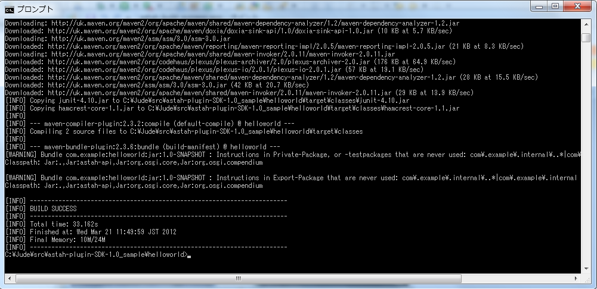

Hello Worldプラグインを作ってみましょう
=======================================================

本章ではメニューの追加を例に、astah*のプラグイン開発を紹介します。

プラグインプロジェクトの新規作成
-------------------------------------------------------

まず、プラグインプロジェクトを新規作成します。プラグインプロジェクトを作成したいディレクトリへ移動し、次のコマンドを入力しましょう。 ::

 > astah-generate-project

astah* SysMLのプラグインプロジェクトを新規作成するには、次のコマンドを入力しましょう。 ::

 > astah-sysml-generate-project
 
続いてgroupId、artifactId、version、パッケージを指定してください。

==================== ============================================================
 Parameter            Description
==================== ============================================================
groupId               プロジェクトの識別名を指定します。一般的には、プロジェクトのルートパッケージ名を指定します。
artifactId            プロジェクト名を指定します。生成されるフォルダ名やjarファイルの名前に使用されます。
version               プロジェクトのバージョンを指定します。
package               プロジェクトのパッケージ名を指定します。groupIdと同じか、下層のパッケージ名を指定してください。
==================== ============================================================

.. figure:: images/astah-generate-project.png
   :width: 640
   :alt: astah*プラグインプロジェクトの生成

エラーがなければ、指定したartifact idと同名のフォルダがプラグインプロジェクトとして作成されます。

.. figure:: images/astah-generate-project-success.png
   :width: 640
   :alt: astah*プラグインプロジェクトの生成の成功

生成されたプロジェクトの内容を簡単に説明します。

==================== ============================================================
 File Name            Description
==================== ============================================================
pom.xml               プロジェクトのビルド情報や、ライブラリの依存情報、Mavenプラグインの設定などを記述します。
Activator.java        プラグインがロードされるときに実行されます。
                      プラグインの初期化処理や終了処理などを定義します。
plugin.xml            メニューなどの拡張ポイントを設定します。
                      この例では、astah*の拡張ポイントとしてメニュー定義を記述します。
                      記述方法は、後ほどプラグインの作り方で説明します。
plugin.properties     astah*プラグインで使用するラベルなどの多言語化のための仕組みです。
                      デフォルトではplugin.propertiesの値が使用され、日本語のラベルを提供する場合はplugin_jp.propertiesに記述される値が使用されます。
==================== ============================================================

開発中のプラグインを読み込んだ状態でastah*を起動しましょう
----------------------------------------------------------

開発中のプラグインを読み込むには、まずビルドしなければなりません。そのために、作成したプラグインプロジェクトのディレクトリへ移動し､次のコマンドを実行してみましょう。 ::

 > astah-build

ビルドが成功すると、targetフォルダが作成され､その中に[artifact id]-[version].jar
というファイルが作成されています｡このファイルがプラグインファイルです｡続いて、このプラグインファイルを読み込んでastah*を起動します。次のコマンドを実行してみましょう。 ::

 > astah-launch

すると、プラグインが読み込まれた状態でastah*が起動します。

.. figure:: images/astah-launch-success.png
   :width: 571
   :alt: astah*プラグインプロジェクトを組み込んでastahの起動に成功

[ヘルプ]-[プラグイン一覧]メニューを見ると､次のようにテンプレートのプラグインが
読み込まれていることを確認できます。

.. figure:: images/plugin-list.png
   :width: 571
   :alt: プラグイン一覧

また、[ツール]メニューの下部にメニューが追加されています。

.. figure:: images/added_menu.png
   :width: 464
   :alt: 追加されたメニュー

IDEにプラグインプロジェクトをインポートしましょう
----------------------------------------------------------

astah* Plug-in SDKはMavenベースのツールです。しかし、実際のプラグイン開発では、astah* Plug-in SDKのみで開発を進めるよりも、Eclipse [#eclipse]_ やIntelliJ IDEA [#IntelliJ]_ など、IDEと連携して開発する場合がほとんどでしょう。

ここでは、EclipseとIntelliJへのプラグインプロジェクトのインポート方法を解説します。お使いのIDEにインポートしてみましょう。

Eclipse
^^^^^^^^^^
EclipseとMavenを連携させるm2eをインストールしておくと、Eclipse上からMavenのコマンドを実行できます｡

Eclipseとm2eのインストール
~~~~~~~~~~~~~~~~~~~~~~~~~~~~

まず、Eclipseとm2eをインストールします。 `Eclipseのサイト <http://eclipse.org/downloads/>`_ より、 ::

  Eclipse IDE for Java Developers

をダウンロードしてください。このパッケージにはm2eが同梱されています。

.. note::

  Eclipseはパッケージを解凍するだけでインストールでき、既存の開発環境に影響を与えません。
  本チュートリアルの実施にはこちらのパッケージをお勧めします。
  もちろん既存環境にm2eをインストールしてastah*プラグインを開発することもできます。
  既存環境へのインストールは`m2eのサイト<http://eclipse.org/m2e/>`_を参考にしてください。

astah* Plug-in SDKをEclipseのMAVEN_HOMEとして設定する
~~~~~~~~~~~~~~~~~~~~~~~~~~~~~~~~~~~~~~~~~~~~~~~~~~~~~

Eclipseを起動し、ワークスペースを選択後、astah* Plug-in SDKをMAVEN_HOMEに設定します。

[Window]-[Preferences]を開き､[Maven]-[Installations]を選択します。下図のようにInstallationsに、astah* Plug-in SDKのインストールフォルダ(ASDK_HOME)を追加してください。

.. figure:: images/Eclipse_settings.png
   :width: 573
   :alt: Eclipse設定ページ

これでEclipse上に読み込む準備ができました。Mavenのプロジェクトとしてインポートしてください。

.. note::

  インストール中、Connectorのインストールを勧める画面が表示される事があります。
  このConnectorは、astah*プラグイン開発に必要なものなので、インストールしてください。

IntelliJ IDEA
^^^^^^^^^^^^^^^^^^^^^^^^^^^^^^^^^^^^^^^^^^^^^^^^^^^^^^^^^^

IntelliJ IDEAには標準でMavenとの連携機能が組み込まれています｡ `IntelliJのサイト <http://www.jetbrains.com/idea/>`_ より、ダウンロードしてください。

初めて起動した時にはプロジェクトの新規作成ウィザードが立ち上がります。既にお使いの場合は、「astah* Plug-in SDKをIntelliJ IDEAのMAVEN_HOMEとして設定する」を行ってから、プロジェクトをインポートしてください｡

生成したプラグインプロジェクトをIntelliJ IDEAにインポートする
~~~~~~~~~~~~~~~~~~~~~~~~~~~~~~~~~~~~~~~~~~~~~~~~~~~~~~~~~~~~~~

生成したプラグインプロジェクトをインポートしましょう。通常の手順と同様のため、割愛します。不明点はIntelliJのヘルプをご参照ください｡

astah* Plug-in SDKをIntelliJ IDEAのMAVEN_HOMEとして設定しましょう
~~~~~~~~~~~~~~~~~~~~~~~~~~~~~~~~~~~~~~~~~~~~~~~~~~~~~~~~~~~~~~~~~~

astah* Plug-in SDKをIntelliJ IDEAのMAVEN_HOMEとして設定しましょう｡

IntelliJを起動後、[File]-[Settings]を開き､[Maven]を選択します｡下図のように、Maven home directoryのOverrideにチェックし、astah* Plug-in SDKのインストールフォルダ(ASDK_HOME)を指定してください。

これでクラスパスが設定されます。

メッセージを表示するメニューを作成しましょう
-------------------------------------------------------------

astah*のプラグインを作成するには、astah*が提供する拡張ポイントの内容を<extension>タグのpoint属性でplugin.xmlに記述する必要があります。現時点で提供している拡張ポイントは以下の2つです。

====================================== ======================================
 Extension Point Name                   Descrption
====================================== ======================================
com.change_vision.astah.ui.actionSets   astah*のメニューに独自メニューを追加
com.change_vision.astah.ui.view         astah*の拡張ビューに独自タブを追加
====================================== ======================================

これから追加するのは、メニューです。下記はメニューを追加するplugin.xmlの例です。

.. literalinclude:: _snippets/plugin_menu.xml
   :language: xml
   :linenos:

この例では<menu>タグを追加し 、[ツール]メニューに[サンプルメニュー]を追加しています。<action>タグでは、[サンプルメニュー]にHello Worldプラグインのメニューを追加しています。

メニューの追加位置は、<menu>タグのpath属性と、<action>タグのmenubarPath属性で指定します。toolは[ツール]メニューのidで、<menu>タグのpath属性と、<action>タグのmenubarPath属性には各メニューのidを記述します。<menu>の中にpath属性とmenubarPath属性は、各メニューのidは :doc:`appendixA` を参照してください。<actionSet>タグは各<action>タグをグループ化します。<action>タグのclass属性で、メニューが押されたときに呼ばれるアクションを定義します。

.. Warning:
  <menu>の中に含む場合は、パスの最後に"/"をつけてください。"/"以外を指定している場合は、指定したidの下に追加されます。該当するidが見つからない場合は、上位のパスから順に検索され、見つかったパスの一番下に追加されます。全く見つからない場合は「プラグイン」というメニューが追加され、その下に開発中のプラグインのメニューが追加されます。

まとめると下記のようになります。

=================== =========== ======== =============================================
Tag Name             Attribute  Required  Description
=================== =========== ======== =============================================
plugin              \            ○       \
extension           \            ○       拡張ポイントを指定します｡
\                   point        ○       com.change_vision.astah.ui.actionSetsを指定
actionSet           \            ○       メニューバーにメニューを追加するグループを指定します。
\                   label        \        (予約属性)
\                   visible      \        (予約属性)
\                   id           \        メニューグループのIDを指定します｡
menu                \            \        グループメニューを追加します。
\                   label        ○       グループメニューのラベルを指定します。
\                   id           ○       グループメニューのIDを指定します｡
\                   path         ○       表示したい位置を指定します｡
action              \            \        メニューを追加します｡
\                   label        ○       メニューのラベルを指定します｡
\                   icon         \        (予約属性)
\                   class        ○       押下した時のクラスを指定します｡
\                   tooltip      \        (予約属性)
\                   menubarPath  ○       表示したい位置を指定します｡
\                   id           ○       メニューのIDを指定します｡
=================== =========== ======== =============================================

アクションの作成方法は後ほど説明します。

ラベルの国際化対応をしましょう
------------------------------

<action>タグのlabel属性には”%menu_label”と記述されています。これは、ラベルの表示を国際化するための記法です。"menu_label"という文字列はキー名です。ラベルの内容は、plugin.propertiesとplugin_ja.propertiesに記述します。

plugin.properties::

  menu_label=&Hello World

plugin_ja.properties::

  menu_label=こんにちは、ワールド(&H)

日本語環境であればplugin_ja.propertiesから、"こんにちは、ワールド"という文字列がロードされます。それ以外の環境ではplugin.propertiesから"Hello World"という文字列がロードされます。

アクションを作成しましょう
--------------------------

メニューバーにメニューを追加できました。これから"Hello World"のメッセージを表示するアクションを作成します。アクションはIPluginActionDelegateインターフェースを実装したクラスで定義します。

.. literalinclude:: _snippets/HelloWorldAction.java
   :language: java
   :linenos:

IPluginActionDelegateインターフェースのrun()メソッドは、対応するastah*のメニューが押されたときに呼び出されます。例では、[Hello World]メニューが押されたときに、"Hello World"という文字列が書かれたダイアログを表示しています。実行中に発生するエラーはIPluginActionDelegateインターフェースの内部クラスUnExpectedExcetpionとして扱っています。

.. rubric:: Footnotes

.. [#eclipse] `http://eclipse.org/ <http://eclipse.org/>`_
.. [#IntelliJ] `http://www.jetbrains.com/idea/ <http://www.jetbrains.com/idea/>`_
